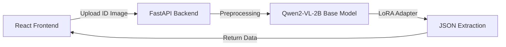

# Fine-Tuned Vision-Language Model for Identity Document Verification & OCR


An end-to-end, production-grade machine learning project focused on semantic Optical Character Recognition (OCR), identity document verification, and precise data extraction. 

Instead of relying on brittle regex rules and traditional OCR pipelines, this project utilizes a **Qwen2-VL-2B-Instruct** Vision-Language Model fine-tuned via **LoRA (PEFT)**. It understands complex document layouts and outputs specific fields (Name, DOB, ID Number, Address) in strictly formatted JSON.

## ✨ Key Features
* **Semantic Extraction:** Bypasses traditional OCR limitations by semantically "understanding" the document's content regardless of layout, rotation, or noise.
* **Strict JSON Output:** Fine-tuned to reliably output structured JSON for seamless downstream integration.
* **Efficient Inference:** Leverages `bfloat16` precision and LoRA adapters to run comfortably on consumer-grade hardware (NVIDIA T4 16GB).
* **Full-Stack Application:** Includes a FastAPI backend for inference and a modern React/Vite frontend for user interaction.

## 🏗️ Architecture



## 💻 Tech Stack
- **Machine Learning:** PyTorch, HuggingFace Transformers, PEFT (LoRA), `qwen_vl_utils`
- **Backend API:** Python, FastAPI, Uvicorn
- **Frontend UI:** React 19, Vite, Tailwind CSS, Lucide React
- **Deployment Infrastructure:** Vercel (Frontend), Google Colab (Backend/GPU), Localtunnel

## 📁 Repository Structure
```text
.
├── backend/            # FastAPI server serving the inference endpoints
├── frontend/           # React/Vite SPA for document upload UI
├── ml/                 # Core machine learning pipeline
│   ├── configs/        # YAML configurations for LoRA training
│   ├── data_pipeline/  # Scripts for dataset parsing and splitting
│   ├── evaluation/     # Accuracy and JSON format adherence metrics
│   ├── training/       # LoRA fine-tuning execution scripts
│   ├── robustness/     # Data augmentation harness for stress-testing
│   └── tampering/      # Forgery and tampering classification
├── docs/               # Project documentation and runbooks
├── sprints/            # Agile sprint tracking and interview prep docs
└── data/               # Raw and processed datasets (Git-ignored)
```

## 🚀 Quick Start (Running Locally)

Since the model requires an NVIDIA GPU for acceptable inference times, the backend is designed to be hosted on Google Colab, while the UI runs locally on your machine.

### 1. Start the Backend (Google Colab)
1. Open a new Google Colab notebook and set the Runtime to **T4 GPU**.
2. Run the following in a cell:
```python
import os
import subprocess

# Clone and enter repo
!git clone https://github.com/pavan542935/Fine-Tuned-Vision-Language-Model-for-Identity-Document-Verification-OCR repo
%cd /content/repo

# Install dependencies
!pip install -r requirements.txt
!pip install fastapi==0.112.2 starlette==0.37.2 uvicorn python-multipart

# Start the server and create a public tunnel
subprocess.Popen(["python", "backend/main.py"])
!npm install -g localtunnel
!lt --port 8000
```
3. Copy the `.loca.lt` URL generated by localtunnel.

### 2. Start the Frontend (Local Machine)
1. Clone this repository locally.
2. If running locally, create a `.env` file in the `frontend` folder:
```env
VITE_API_URL="your-localtunnel-url-here"
```
3. Install and run:
```bash
cd frontend
npm install
npm run dev
```
4. Open `http://localhost:5173` in your browser.

> **Note:** If you encounter a `Failed to fetch` error, open your `.loca.lt` URL directly in a new tab first to bypass the localtunnel anti-spam screen.
